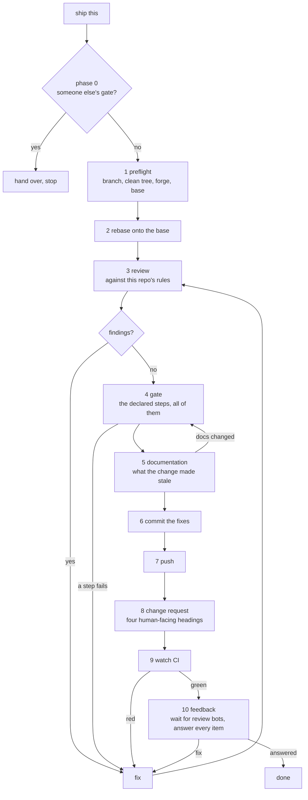

# publish

An agent skill that takes committed work through a gate — adversarial review,
then whatever tests, lint and docs commands the repository declares for itself,
then the documentation the change made stale — and only then pushes, opens the
change request, and waits for CI to go green.

A change request is a pull request on GitHub and a merge request on GitLab. The
gate is the same either way: four phases touch the forge, through five
operations, and both adapters ship complete.

The change request body has four clear sections: intent, change, risk and testing.
The skill checks the current head, runs the repository gate and waits for CI;
it reports the checked commit and results to the requester.

## Install

```sh
npx skills@latest add https://github.com/Thurbeen/publish \
  --skill publish --agent universal claude-code --global --yes
```

`--global` installs it for your user, so one install covers every repository you
publish from. `universal` puts the one real copy in `~/.agents/skills/publish`,
the directory that is not tied to any one agent. Every other agent you name gets
a symlink to that copy, such as `~/.claude/skills/publish` →
`../../.agents/skills/publish`, so an update lands everywhere at once. Swap
`claude-code` for any agents [`skills`](https://www.npmjs.com/package/skills)
supports, but keep `universal` and at least one more: with `--yes` and a single
target, the CLI copies instead of linking. Nothing goes on `PATH` and nothing is
compiled — the skill is prose an agent reads, and that is the whole deliverable.

## When an agent should load it

On "push this", "ship it", "publish", "open a PR", "get this merged" — and on
any task whose own instructions say to publish its work.

Not when the repository ships its own `publish`, `ship` or `release` skill, and
not when it already has a gate tool installed and configured in that clone.
Both of those push and open a change request too, and running two of them is how
a branch ends up with two.

## What it does



The change request body has four headings, in this order: `## Intent`,
`## What Changed`, `## Risk Assessment` and `## Testing`. It carries no
machine attestation.

Every phase reports one of four statuses — `passed`, `failed`, `skipped`,
`not-applicable` — and the verdict is `passed` only when every step is `passed`
or `not-applicable`. A step that could not run blocks. A red pipeline blocks. A
pipeline still running blocks. There is no fifth status to hide in.

The review phase is the product and the rest is plumbing around it: measured
against the tool this replaces, review produced the large majority of the fixes
and every other step produced a handful between them. The method it follows —
what to read first, the ten passes, the rule that every finding carries a
concrete failure scenario — is in
[`skills/publish/references/review.md`](skills/publish/references/review.md).

## How a repository declares its gate

`.publish.yaml`, at the repository root:

```yaml
version: 1

forge: github
base: main

review:
  rules:
    - AGENTS.md

gate:
  - name: lint
    run: just lint
    fix: just fmt
  - name: test
    run:
      - cargo nextest run --all
      - cargo test --doc
    instructions: "The sqlite tests share one port, so a bind failure means an earlier run is still up. Stop it and re-run."

ci:
  required: true
  timeout: 30m

feedback:
  wait: 15m
```

| key | required | meaning |
| --- | --- | --- |
| `version` | yes | `1`. |
| `forge` | no | `github` or `gitlab`. Default: matched from the origin remote's host. |
| `base` | no | Branch to rebase onto and target. Default: the remote's default branch. |
| `review.rules` | no | Extra files the review must read. |
| `gate` | yes | Ordered list of steps, run in the order written. |
| `gate[].name` | yes | The step's name in the final report. Free text. |
| `gate[].run` | yes | One command, or a list run in order, from the repository root. |
| `gate[].fix` | no | Applies the mechanical fixes, once, before a re-run. |
| `gate[].instructions` | no | Text handed, as written, to whoever runs, reads or fixes the step. Anything but text is a broken declaration. |
| `ci.required` | no | Default `true`. `false` declares the repository has no CI. |
| `ci.timeout` | no | Default `30m`. |
| `feedback.wait` | no | Default `15m`. How long to keep reading feedback after CI is green, for review bots that post after it. |

`gate: []` declares a repository with no mechanical gate, and records
`not-applicable`. Leaving `gate` out entirely is not the same thing: the skill
falls back to `AGENTS.md` / `CLAUDE.md` / `CONTRIBUTING.md`, then a task
runner's check target, then the package manifest's scripts — naming an inferred source as `discovered:<file>` in the final report — and if none of those yields
commands, the gate is `skipped` and the verdict is `blocked`.

The full contract, including what a repository whose whole gate is one script
writes, is in
[`skills/publish/references/gate.md`](skills/publish/references/gate.md).

## Layout

```
skills/publish/SKILL.md                          the skill an agent loads
skills/publish/references/gate.md                how a repository declares its gate
skills/publish/references/review.md              the review method — the product
skills/publish/references/forge.md               the five forge operations, per adapter
skills/publish/references/feedback.md            the feedback ledger, review bots, the wait and the loop cap
skills/publish/templates/change-request-body.md  the four-heading body to fill in
```

`npx skills add` installs `skills/publish/` and nothing else, into
`.agents/skills/publish` with each agent's directory linked to it, so everything
the skill promises lives inside that directory.
[`tests/skill-self-contained.test.mjs`](tests/skill-self-contained.test.mjs) is
what keeps it that way.

## Tests

```sh
npm test
```

The skill is prose, so there is no output to assert. The suite checks the things
that rot, and the two properties everything else depends on:

| what | where |
| --- | --- |
| The shipped body renders with four headings and no machine block | `tests/clean-change-request.test.mjs` |
| A skipped step and a red pipeline cannot be reported as success, and no test in this suite opts out of running | `tests/no-silent-skip.test.mjs` |
| Every link resolves inside the installed copy, and nothing shipped is unreachable | `tests/skill-self-contained.test.mjs` |
| The documented declaration examples use the documented keys, a step's `instructions` are text or absent, and an undeclared gate blocks | `tests/gate.test.mjs` |
| The frontmatter, the phases in order with documentation between the gate and the commit, the install command and the repository it installs from, that the README and skill agree on the body and declaration keys, and that every forge adapter gives all five operations | `tests/skill.test.mjs` |
| The body has exactly four human-facing headings | `tests/change-request-body.test.mjs` |
| Each adapter's documented feedback query, normalised and run through the shared ledger against a recorded forge response, lists every thread, review, comment and bot summary with the head it reviewed; phase 10 waits for late reviewers, loops thurview to 5/5 and caps a point at two rounds | `tests/feedback.test.mjs` |
| `All Checks` needs every other CI job and passes only when each succeeded, and `PR Title` accepts conventional commits and nothing else | `tests/ci.test.mjs` |

CI reports two checks that stand for all of it, named so that branch protection
on `main` can require them without changing whenever a job does:

- **`All Checks`**, the last job in `.github/workflows/ci.yml`. It needs every
  other job there, and fails if any of them failed, was cancelled or was
  skipped.
- **`PR Title`**, from `.github/workflows/pr-title.yml`. Squash merge makes the
  title the commit on `main`, so it must be a conventional commit:
  `type(scope)!: description`, scope and `!` optional, with a type from `feat`,
  `fix`, `perf`, `refactor`, `docs`, `style`, `test`, `chore`, `build`, `ci` or
  `revert`. It runs again whenever the title is edited.

## License

MIT. See [LICENSE](LICENSE).
